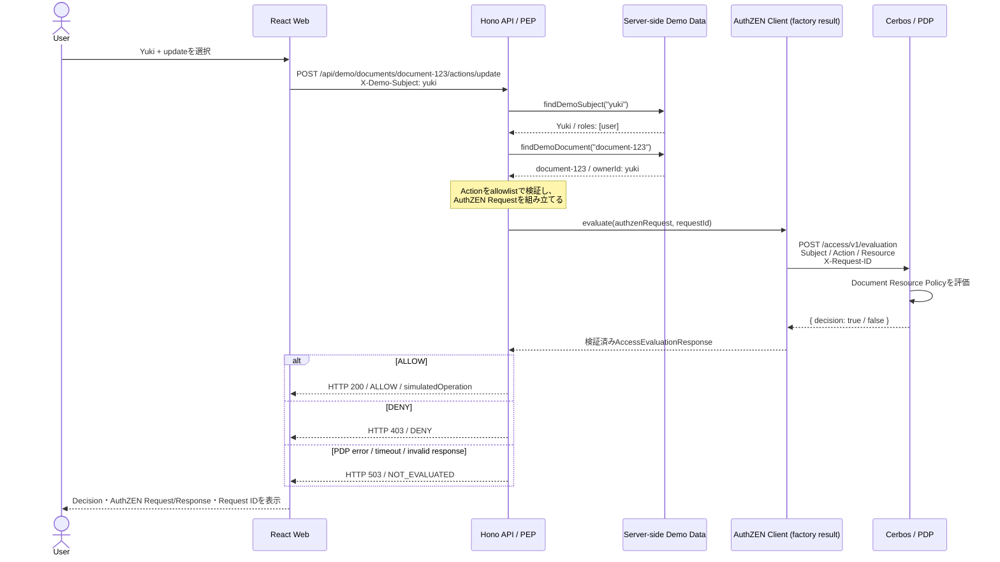

# System Design

## 1. Architecture

```text
React Authorization Evaluation Tool
  ↓ HTTP
Hono API
  Policy Enforcement Point
  ↓ createAuthZenClient().evaluate()
POST /access/v1/evaluation
  ↓
Cerbos
  Policy Decision Point
  ↓
Document Resource Policy
```

## 2. End-to-end request sequence

フロントエンドからCerbosを直接呼ぶのではなく、まずReact WebがHono APIを呼び、HonoがPEPとして認可材料を確定したあと、`createAuthZenClient()`で生成したclient経由でCerbosのAuthZEN Endpointへ問い合わせる。

React WebとHono APIの間のApplication API詳細は [Frontend-facing Demo API](./api/frontend-api.md) を参照する。



この図ではHTTP通信が2段階ある。

1. **React Web → Hono API**: Demo Subject、Resource ID、ActionをアプリケーションAPIへ渡す。
2. **AuthZEN client → Cerbos**: HonoがServer-side情報から組み立てたAuthZEN Access Evaluation RequestをPDPへ送る。

Roleや`ownerId`はReact Webから送らず、HonoがServer-side dataから解決する。

## 3. Repository structure

```text
apps/
  web/          React / Vite
  api/          Hono / PEP Middleware / AuthZEN client factory
packages/
  contracts/    API and AuthZEN contracts
  domain/       Demo Subject, Resource, Action vocabulary
cerbos/
  policies/     Cerbos Resource Policy
docs/
  api/          Frontend-facing Application API specification
  requirements.md
  design.md
  security/boundaries.md
  learning/     Code guide
tests/
  repository-level Integration and E2E support
```

## 4. Component responsibilities

| Component      | Responsibility                                                  |
| -------------- | --------------------------------------------------------------- |
| React Web      | Input selection and evaluation result visualization             |
| Hono API       | Trusted attribute collection, PDP request, Decision enforcement |
| PEP Middleware | Subject、Resource、Actionの検証とContext伝搬                    |
| AuthZEN Client | AuthZEN transport, timeout, response validation and errors      |
| Contracts      | Shared API and AuthZEN message types                            |
| Domain         | Fixed Demo Subject, Resource and Action vocabulary              |
| Cerbos         | Policy evaluation and boolean Decision                          |
| Cerbos Policy  | Owner and Admin authorization rules                             |

## 5. Request flow

1. WebまたはAPI ClientがDemo SubjectとActionを送る。
2. `demoAuthenticate`がSubject IDをServer-side mapで解決する。
3. `loadDocument`がURLのResource IDをServer-side repositoryで解決する。
4. `authorizeDocument`がAction allowlistを検証する。
5. Honoが信頼できる属性だけでAuthZEN Access Evaluation Requestを作る。
6. `createAuthZenClient()`が返す`evaluate()`が`X-Request-ID`とTimeoutを付けてPDPへ送信する。
7. CerbosがDocument Resource Policyを評価する。
8. AuthZEN clientが外部JSON Responseを検証する。
9. HonoがALLOW、DENY、評価不能をAPI処理へ強制する。
10. ALLOWの場合だけSimulation handlerを実行する。
11. 後続のWeb UIがRequest、Response、Request ID、enforcement resultを表示する。

## 6. Error model

| State                      | Hono HTTP | Business operation |
| -------------------------- | --------: | ------------------ |
| PDP Allow                  |     `200` | Simulated          |
| PDP Deny                   |     `403` | Not executed       |
| Invalid Demo Subject       |     `401` | Not executed       |
| Resource missing           |     `404` | Not executed       |
| Invalid Action             |     `400` | Not executed       |
| PDP unavailable or invalid |     `503` | Not executed       |

Policy DenyとPDP Errorは、どちらも処理を停止するが異なる状態として扱う。

## 7. Cerbos Policy boundary

Cerbos 0.55.0をDocker Composeで起動し、disk storageから`cerbos/policies`を読み込む。ローカルPoCではHTTP `3592`とgRPC `3593`をループバックアドレスに公開する。

今回のAuthZEN Mapping:

```text
subject.id
→ principal.id

subject.properties.cerbos.roles
→ principal.roles

resource.type
→ resource.kind

resource.properties.*
→ resource.attr.*

action.name
→ Cerbos action
```

Document Policyは次の3Ruleだけを持つ。

1. `user`と`admin`は`read`できる。
2. `user`は`ownerId == principal.id`の場合だけ`update`と`delete`ができる。
3. `admin`はOwnerに関係なく`update`と`delete`ができる。

該当するALLOW Ruleがない場合はDefault Denyとなる。Policy repositoryのcompile testと、AuthZEN Endpointへ直接送るIntegration Testの両方で検証する。

## 8. AuthZEN Client boundary

`apps/api/src/authzen/`はPDP通信を一箇所へ集約する。`createAuthZenClient()`は設定値をclosureへ閉じ込め、`evaluate()`を持つplain objectを返す。

Clientの責務:

- Base URLへ`/access/v1/evaluation`を追加する
- JSON `POST`と`X-Request-ID`を送信する
- 設定可能なTimeoutでRequestを中断する
- non-2xxをPolicy Denyとは異なるHTTP Errorとして扱う
- JSONを`unknown`として読み、`decision`と任意`context`をRuntime検証する
- `decision: true`と`decision: false`を正常なResponseとして返す
- HTTP、JSON、Payload、Network、Timeoutを識別可能なError codeへ分類する

## 9. Hono PEP boundary

PEPは次のMiddlewareへ分割する。

```text
demoAuthenticate
  ↓
loadDocument
  ↓
authorizeDocument
  ↓
simulated handler
```

属性の情報源:

- `subject.id`: `X-Demo-Subject`をServer-side mapで解決した結果
- `subject.properties.cerbos.roles`: 同じServer-side Subject record
- `resource.id`: URL parameterをServer-side repositoryで検索した結果
- `resource.properties.ownerId`: Server-side Document record
- `action.name`: Route parameterをServer-side allowlistで検証した値

`authorizeDocument`はPDPの`decision: false`を403へ適用する。Timeout、HTTP Error、Network Error、不正JSON、不正Payloadでは評価が完了していないため503を返し、handlerへ進めない。

ALLOWの場合だけ、MiddlewareがHono ContextへDocument ActionとAuthorization Traceを保存する。Handlerは同じContext値を使うため、Resourceを再取得しない。
